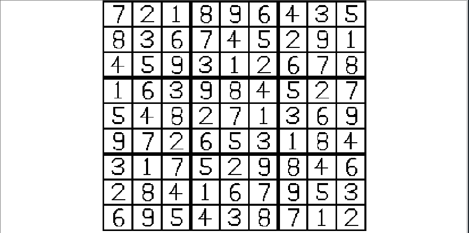

# Sudoku Generator (Nand2Tetris Project 9)

A simple Sudoku puzzle generator written in Jack for the Nand2Tetris platform.

## Files

- `Main.jack`: Entry point and Display Instruction.
- `SudokuGenerator.jack`: Puzzle generation logic.
- `Board.jack`: 9x9 board representation.
- `Digit.jack`: Draws digits on screen.
- `Random.jack`: Pseudo-random number utilities.

## Usage

1. [Open the project folder in the online Jack compiler.](https://nand2tetris.github.io/web-ide/compiler)
2. Click "Compile" to build the project, then click "Run" to navigate to the VM Emulator.
3. Set execution speed to maximum, then click "Run".
4. Follow on-screen instructions.

## Screenshot

---

Created for Nand2Tetris Project 9.